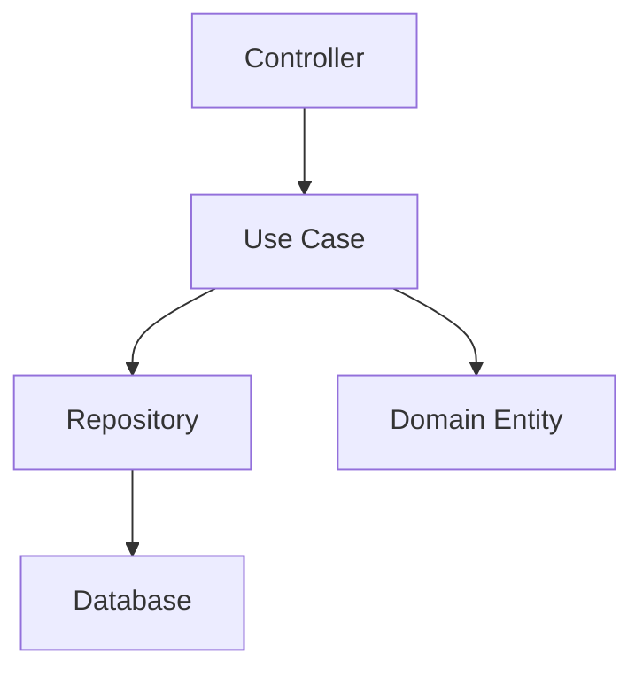

# Arquitetura do Sistema

## Visão Geral

O **Would Like Backend App** segue os princípios da **Clean Architecture** combinada com **Arquitetura Hexagonal**, priorizando simplicidade e evolução incremental.

## Princípios Fundamentais

### 1. Clean Architecture
- **Independência de Frameworks**: O core não depende de Spring ou outras tecnologias
- **Testabilidade**: Casos de uso podem ser testados independentemente
- **Independência de UI/Database**: Domínio não conhece REST ou MySQL
- **Regras de Dependência**: Dependências apontam sempre para dentro

### 2. Arquitetura Hexagonal (Ports & Adapters)
- **Portas**: Interfaces que definem contratos
- **Adaptadores**: Implementações concretas das portas
- **Core Isolado**: Lógica de negócio independente de infraestrutura

## Estrutura de Camadas

### Domain Layer (Domínio)
```java
src/main/java/com/wouldlike/backendapp/domain/
├── User.java          # Entidade usuário
├── Wishlist.java      # Entidade lista de desejos  
└── Item.java          # Entidade item da lista
```

**Responsabilidades:**
- Definir entidades de negócio
- Regras de domínio
- Value Objects (futuro)
- Domain Services (futuro)

### Application Layer (Aplicação)
```java
src/main/java/com/wouldlike/backendapp/application/usecase/
├── GetAllUsersUseCase.java
├── CreateUserUseCase.java
├── UpdateUserUseCase.java
├── DeleteUserUseCase.java
├── GetWishlistsByUserIdUseCase.java
├── CreateWishlistUseCase.java
└── ...
```

**Responsabilidades:**
- **Um caso de uso por classe** (Single Responsibility)
- Orquestrar lógica de negócio
- Coordenar chamadas ao domínio
- **NÃO** chamar outros casos de uso

**Padrão dos Casos de Uso:**
```java
@Component
public class CreateUserUseCase {
    private final UserRepository userRepository;
    
    public CreateUserUseCase(UserRepository userRepository) {
        this.userRepository = userRepository;
    }
    
    public User execute(User user) {
        // Lógica específica deste caso de uso
        return userRepository.save(user);
    }
}
```

### Infrastructure Layer (Infraestrutura)

#### Persistence (Adaptadores de Persistência)
```java
src/main/java/com/wouldlike/backendapp/infrastructure/persistence/
├── UserRepository.java      # Porta (interface JPA)
├── WishlistRepository.java  # Porta (interface JPA)
└── ItemRepository.java      # Porta (interface JPA)
```

#### Web (Adaptadores Web)
```java
src/main/java/com/wouldlike/backendapp/infrastructure/web/
├── UserController.java      # REST adapter
├── WishlistController.java  # REST adapter
└── ItemController.java      # REST adapter
```

#### Configuration (Configurações)
```java
src/main/java/com/wouldlike/backendapp/infrastructure/config/
├── SecurityConfig.java      # Configuração de segurança
├── JwtConfig.java          # Configuração JWT (futuro)
└── DatabaseConfig.java     # Configuração de banco (futuro)
```

## Fluxo de Dados



1. **Controller** recebe requisição HTTP
2. **Use Case** executa lógica de negócio
3. **Repository** persiste/busca dados
4. **Entity** representa estado do domínio

## Regras de Dependência

### ✅ Permitido
- Use Case → Repository (interface)
- Controller → Use Case
- Controller → Multiples Use Cases
- Repository impl → JPA/Database

### ❌ Proibido
- Use Case → Use Case (evitar acoplamento)
- Domain → Infrastructure
- Use Case → Controller

## Evoluções Futuras

### Fase 2 - Melhorias Arquiteturais
- **Domain Services**: Para lógica de negócio complexa
- **Value Objects**: Para conceitos de domínio
- **Events**: Para comunicação entre agregados
- **Specifications**: Para consultas complexas

### Fase 3 - Infraestrutura Avançada
- **Cache Layer**: Redis para performance
- **Message Queue**: RabbitMQ para eventos
- **Monitoring**: Actuator + métricas
- **API Gateway**: Para múltiplos clientes

## Benefícios da Abordagem

1. **Testabilidade**: Cada caso de uso é testável independentemente
2. **Manutenibilidade**: Mudanças isoladas em camadas específicas  
3. **Escalabilidade**: Fácil adição de novos casos de uso
4. **Flexibilidade**: Troca de implementações sem afetar o core
5. **Clareza**: Cada classe tem responsabilidade bem definida

## Exemplo Prático

Para adicionar um novo caso de uso "Compartilhar Lista":

1. Criar `ShareWishlistUseCase.java` na camada de aplicação
2. Implementar lógica específica (validações, regras)
3. Injetar repositórios necessários (não outros use cases)
4. Criar endpoint no controller correspondente
5. Escrever testes unitários e de integração

Esta abordagem garante que o crescimento do sistema seja controlado e sustentável.
